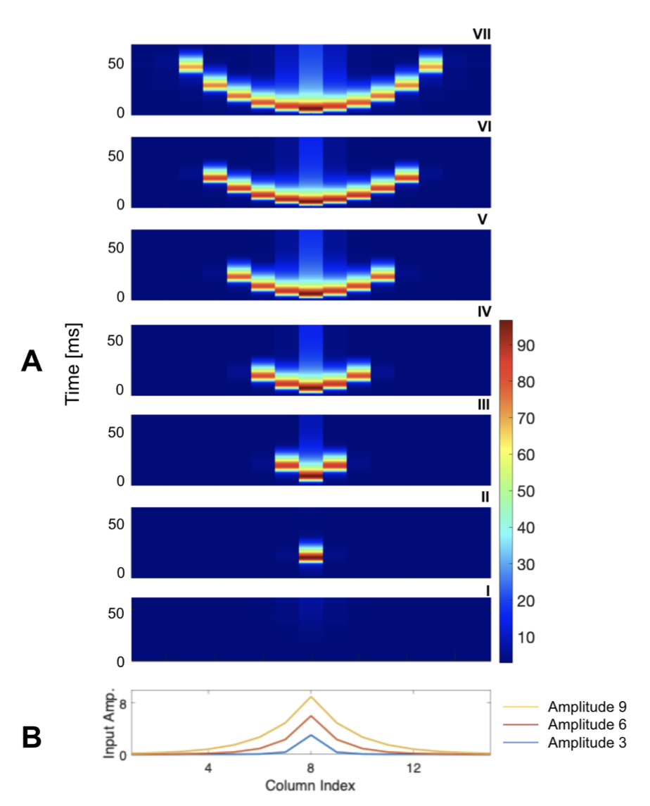
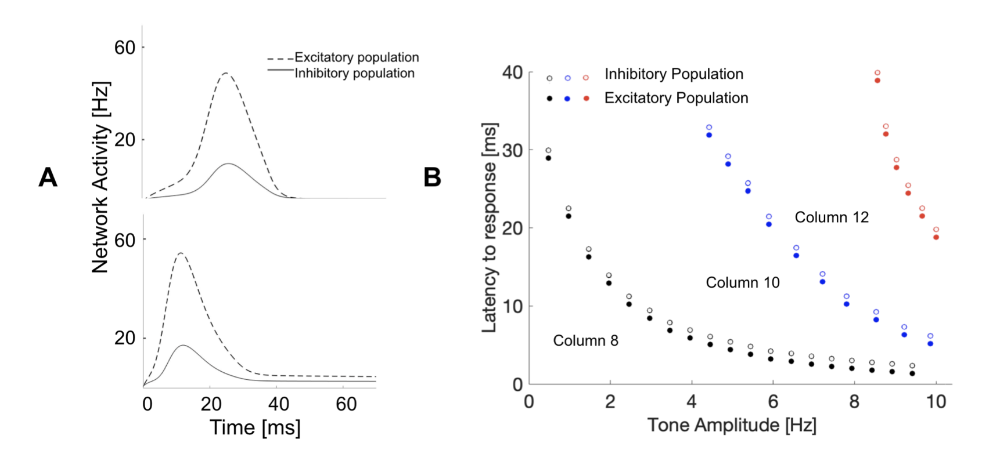
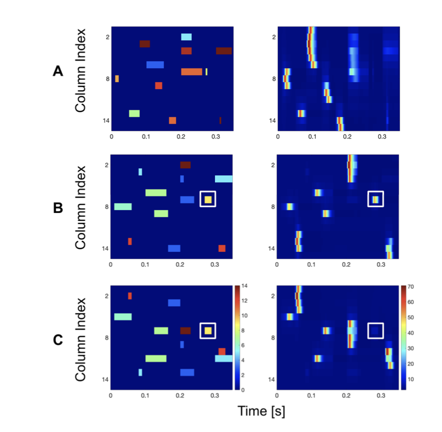

# Processing of sounds by population spikes in a model of primary auditory cortex

The primary auditory cortex plays a crucial role in localising and processing complex sounds. The tonotopic organisation of A1 is mapped such that neurons with similar frequencies are oriented in separate iso-frequency bands (i.e., tonotopic axis). In this study, we replicate a model whereby each iso-frequency column is described by a recurrent neural network with short-term synaptic depression. In particular, this network generates population spikes, in which a group of neurons synchronously fire for a short time period. To mimic the tonotopic organisation of A1, frequency bands are inter-connected where population spikes will disseminate from one column to neighbouring columns depending on the input’s characteristics. Consequently, incoming sounds are processed through sequences of population spikes that contain distinct information about simple and complex tones. Furthermore, we demonstrate the effect of noisy sensory input to the propagation and response of population spikes. We replicate frequency tuning curves of iso-freqeuncy columns, which rely on the strength of intracortical inhibitory and excitatory connections. We also show that consecutive two-tone stimuli exhibit forward masking which are contingent on spatial and temporal properties of the inputs, alongside PS-based encoding scheme for processing complex sounds (i.e., different amplitude and frequencies).

# Spread of population spike in the auditory columns

# Temporal co-tuning of the excitatory and inhibitory population

# Forward masking with varied maskers

